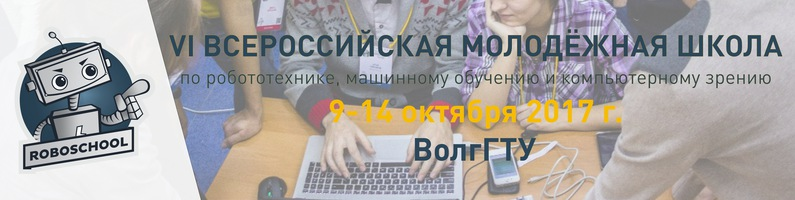

# Робошкола-2018
Материалы к хакатону по управлению колесными платформами

Презентации:
 - [ROS. Моделирование роботов в среде Gazebo](ROS_Gazebo.pdf)
 - Использование ROS, Gazebo и OpenCV для распознавания дорожной разметки